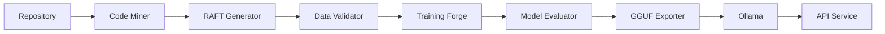

# 🔥 AI Forge

**Local LLM Fine-Tuning Service for Mac Apple Silicon**

[](https://github.com/ai-forge/ai-forge/actions/workflows/tests.yml)
[](https://www.python.org/downloads/)
[](https://opensource.org/licenses/MIT)

AI Forge is a production-grade service for fine-tuning LLMs on your local Mac. It combines cutting-edge techniques (PiSSA, QLoRA, RAFT) to deliver fast, memory-efficient training with minimal setup.

## ✨ Key Features

| Feature | Description |
|---------|-------------|
| **PiSSA + QLoRA** | 10x faster than vanilla LoRA with better convergence |
| **Mac Optimized** | Native Apple Silicon support with MLX acceleration |
| **RAFT Data Synthesis** | Automatic training data generation from your codebase |
| **One-Click Ollama** | Deploy fine-tuned models to Ollama instantly |
| **OpenAI Compatible** | Drop-in replacement for OpenAI API |
| **Autonomous Agent** | Repo Guardian monitors and retrains automatically |

## 🏗️ Architecture



## 🚀 Quick Start (5 Minutes)

### Prerequisites

- macOS 13+ (Ventura or later)
- Apple Silicon (M1/M2/M3)
- Python 3.11+
- 16GB+ RAM recommended (8GB minimum)

### Installation

```bash
# Clone repository
git clone https://github.com/ai-forge/ai-forge.git
cd ai-forge

# Create virtual environment
python -m venv .venv
source .venv/bin/activate

# Install dependencies
pip install -e ".[dev]"

# Install Ollama
brew install ollama
```

### Run Quick Fine-Tune

```bash
# 1. Start the service
python -m conductor.service

# 2. In another terminal, trigger fine-tuning
curl -X POST http://localhost:8000/v1/retrain \
  -H "Content-Type: application/json" \
  -d '{"project_path": ".", "force": true}'

# 3. Query your fine-tuned model
curl http://localhost:8000/v1/chat/completions \
  -H "Content-Type: application/json" \
  -d '{"messages": [{"role": "user", "content": "Explain this codebase"}]}'
```

## 📊 Performance

| Hardware | Model Size | Training Time | Memory Usage |
|----------|------------|---------------|--------------|
| M3 Max (64GB) | 7B | ~15 min | ~12GB |
| M2 Pro (32GB) | 3B | ~8 min | ~6GB |
| M1 (16GB) | 3B | ~12 min | ~8GB |

## 📖 Documentation

| Document | Description |
|----------|-------------|
| [Architecture](docs/architecture.md) | System design and components |
| [User Guide](docs/user_guide.md) | Step-by-step tutorials |
| [API Reference](docs/api_reference.md) | Complete API documentation |
| [Developer Guide](docs/developer_guide.md) | Extending the system |
| [Configuration](docs/configuration.md) | All config options |
| [Troubleshooting](docs/troubleshooting.md) | Common issues and fixes |

## 🧪 Testing

```bash
# Run all tests
pytest

# Run unit tests only
pytest -m unit

# Run with coverage
pytest --cov=ai_forge --cov-report=html
```

## 🏛️ Project Structure

```
ai_forge/
├── data_pipeline/       # Code mining and RAFT generation
│   ├── miner.py         # AST-based code extraction
│   ├── raft_generator.py # Training data synthesis
│   └── validator.py     # Data quality validation
├── training/            # PiSSA + QLoRA training
│   ├── forge.py         # Main training engine
│   └── callbacks/       # Training callbacks
├── judge/               # Model evaluation
│   ├── evaluator.py     # Metrics computation
│   └── exporter.py      # GGUF export
├── conductor/           # API service
│   ├── service.py       # FastAPI endpoints
│   └── ollama_manager.py # Ollama integration
└── antigravity_agent/   # Autonomous orchestration
    ├── repo_guardian.py # Pipeline automation
    └── skills.yaml      # Agent capabilities
```

## 🔬 Research Background

AI Forge implements techniques from recent research:

- **[PiSSA](https://arxiv.org/abs/2404.02948)** - Principal Singular values and Singular vectors Adaptation
- **[QLoRA](https://arxiv.org/abs/2305.14314)** - Quantized Low-Rank Adaptation
- **[RAFT](https://arxiv.org/abs/2403.10131)** - Retrieval Augmented Fine-Tuning

See [Research Summary](docs/research_summary.md) for details.

## 🤝 Contributing

Contributions are welcome! Please see our [Contributing Guide](CONTRIBUTING.md).

```bash
# Install development dependencies
pip install -e ".[dev]"

# Install pre-commit hooks
pre-commit install

# Run tests before submitting
pytest
```

## 📄 License

MIT License - see [LICENSE](LICENSE) for details.

## 🙏 Acknowledgments

- [Unsloth](https://github.com/unslothai/unsloth) for MLX optimizations
- [Ollama](https://ollama.ai) for local model serving
- [HuggingFace](https://huggingface.co) for transformers ecosystem

---

**Made with ❤️ for the Mac developer community**
