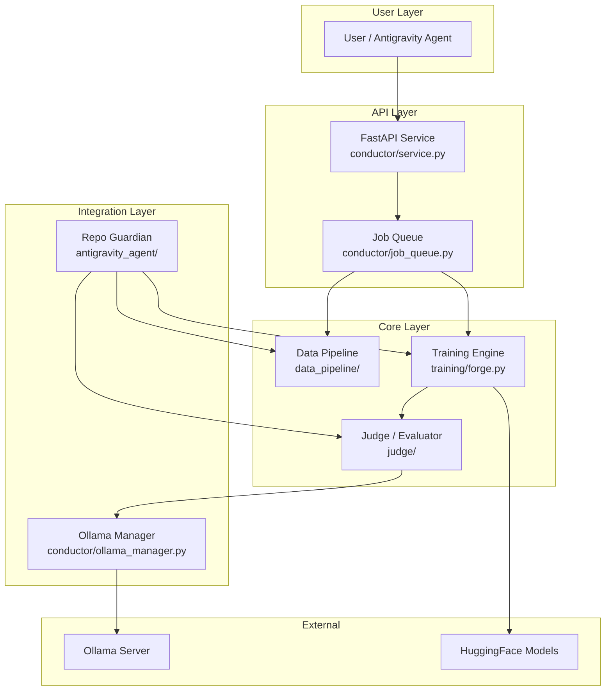
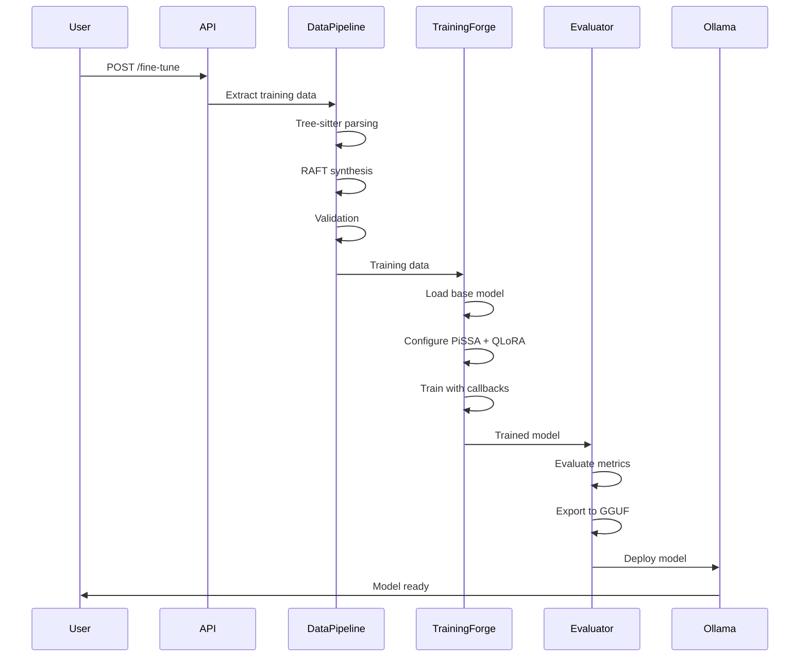

# AI Forge Architecture

## System Overview

AI Forge is a production-grade Local LLM Fine-Tuning Service designed for Mac Apple Silicon. It provides end-to-end capabilities from data extraction to model deployment.

## Architecture Diagram

## Module Responsibilities

### Data Pipeline (`data_pipeline/`)

| Component | Responsibility |
|-----------|---------------|
| `miner.py` | Tree-sitter AST-based code extraction |
| `raft_generator.py` | RAFT training data synthesis |
| `validator.py` | Data quality validation |
| `schemas/` | Pydantic data models |

### Training Engine (`training/`)

| Component | Responsibility |
|-----------|---------------|
| `forge.py` | Main training orchestrator (PiSSA + QLoRA) |
| `callbacks/` | Training callbacks (metrics, early stopping, memory) |
| `losses/` | Custom loss functions (DPO, RAFT) |

### Judge (`judge/`)

| Component | Responsibility |
|-----------|---------------|
| `evaluator.py` | Multi-metric evaluation |
| `exporter.py` | GGUF conversion pipeline |
| `benchmarks/` | Benchmark suite definitions |

### Conductor (`conductor/`)

| Component | Responsibility |
|-----------|---------------|
| `service.py` | FastAPI REST endpoints |
| `ollama_manager.py` | Ollama lifecycle management |
| `job_queue.py` | Async job management |

### Antigravity Agent (`antigravity_agent/`)

| Component | Responsibility |
|-----------|---------------|
| `repo_guardian.py` | Autonomous pipeline orchestration |
| `skills.yaml` | Agent skill definitions |
| `artifacts_templates/` | Report templates |

## Data Flow

## Key Design Decisions

1. **PiSSA over LoRA**: 3-5x faster convergence, +5.16% accuracy
2. **QLoRA (4-bit)**: 75% memory reduction for Mac
3. **Tree-sitter**: Semantic chunking prevents mid-function splits
4. **RAFT**: Hybrid RAG+FT for robust domain adaptation
5. **Ollama**: Simplest local deployment via GGUF
