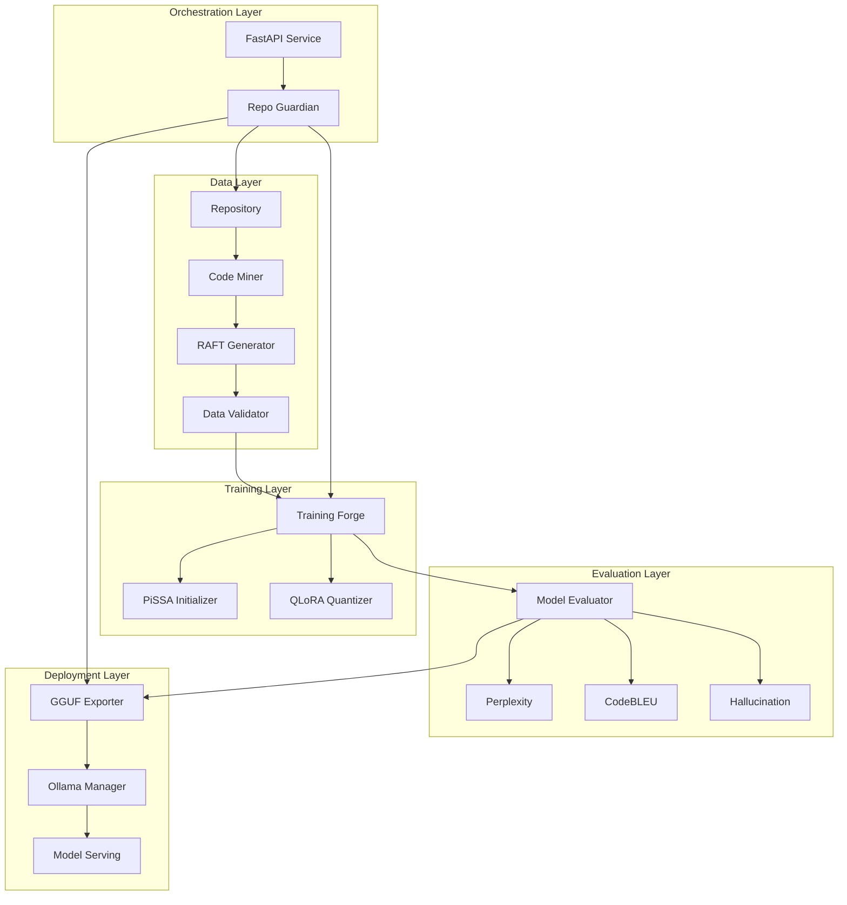
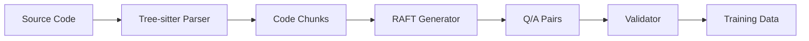
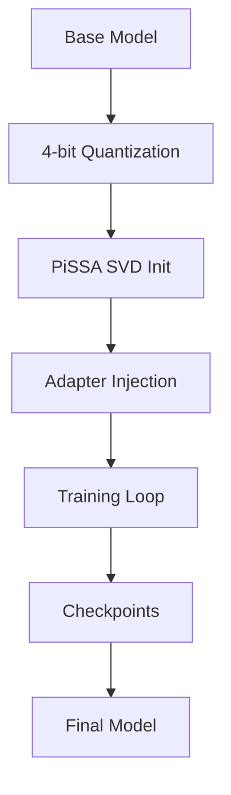
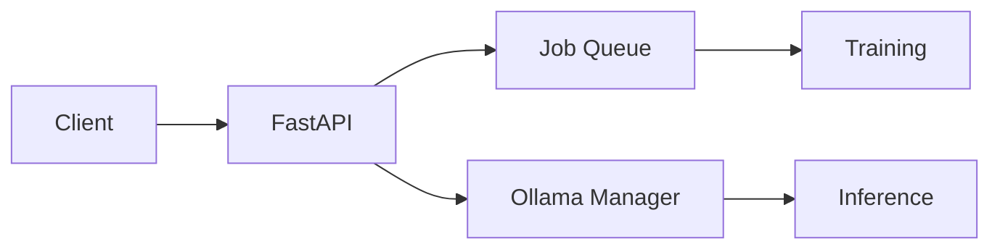
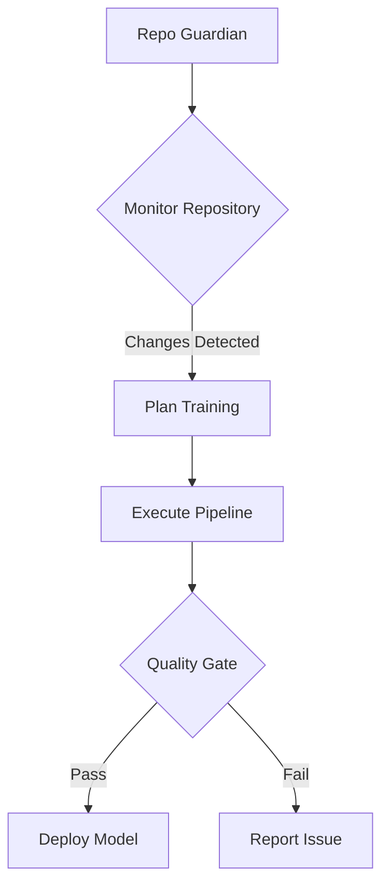
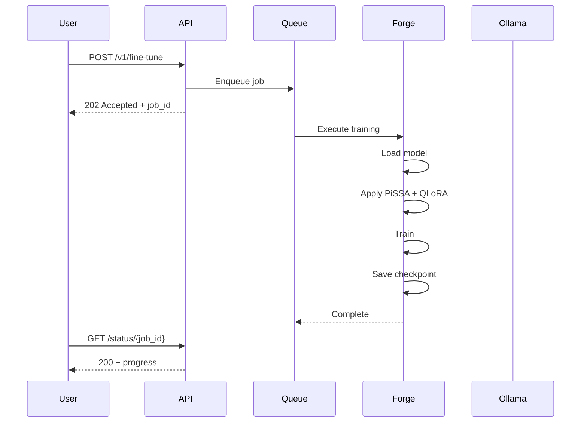
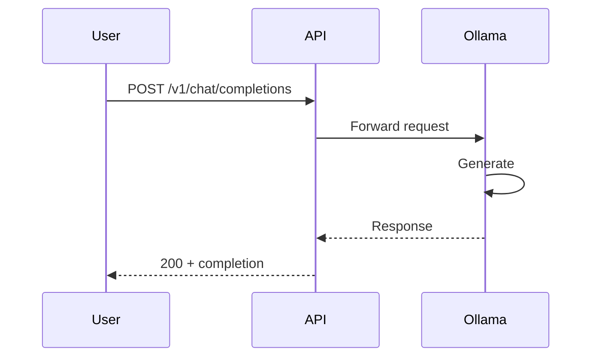
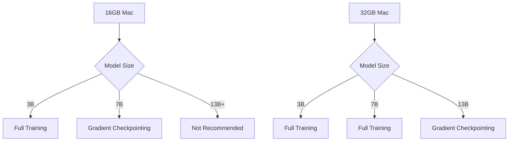

# Architecture

This document describes the system architecture of AI Forge.

## System Overview

AI Forge is designed as a modular pipeline for fine-tuning LLMs on local hardware. Each component is independent and communicates through well-defined interfaces.



## Components

### 1. Data Pipeline (`data_pipeline/`)

**Purpose:** Extract code from repositories and synthesize training data.



| Component | File | Purpose |
|-----------|------|---------|
| CodeMiner | `miner.py` | AST-based code extraction |
| RAFTGenerator | `raft_generator.py` | Training data synthesis |
| DataValidator | `validator.py` | Quality scoring |

**Key Features:**
- Multi-language support (Python, JavaScript, Go)
- Complete function extraction (no mid-function splits)
- Docstring preservation
- Quality heuristics

### 2. Training Engine (`training/`)

**Purpose:** Fine-tune LLMs using PiSSA + QLoRA.



| Component | File | Purpose |
|-----------|------|---------|
| TrainingForge | `forge.py` | Main training orchestrator |
| PiSSAInitializer | `pissa.py` | SVD-based initialization |
| Callbacks | `callbacks/` | Metrics, early stopping, plotting |

**PiSSA vs LoRA:**

```
Standard LoRA:
W' = W + BA    (random init)

PiSSA:
W' = W + BA    (SVD-based init from W)

Benefit: 10x faster convergence, better final quality
```

### 3. Evaluation System (`judge/`)

**Purpose:** Evaluate model quality and export for deployment.

| Component | File | Purpose |
|-----------|------|---------|
| ModelEvaluator | `evaluator.py` | Metrics computation |
| GGUFExporter | `exporter.py` | llama.cpp export |
| EvaluationReport | `report.py` | Report generation |

**Metrics:**
- Perplexity (lower is better)
- CodeBLEU (code similarity)
- Hallucination rate (factuality)
- Exact match rate

### 4. API Service (`conductor/`)

**Purpose:** REST API for fine-tuning and inference.



| Component | File | Purpose |
|-----------|------|---------|
| FastAPI App | `service.py` | REST endpoints |
| OllamaManager | `ollama_manager.py` | Model serving |
| JobQueue | `job_queue.py` | Async job management |

**Endpoints:**
- `POST /v1/fine-tune` - Start training
- `GET /status/{job_id}` - Job status
- `POST /v1/chat/completions` - OpenAI-compatible chat
- `POST /v1/retrain` - Trigger via agent

### 5. Autonomous Agent (`antigravity_agent/`)

**Purpose:** Automated pipeline orchestration.



| Component | File | Purpose |
|-----------|------|---------|
| RepoGuardian | `repo_guardian.py` | Orchestrator |
| Skills | `skills.yaml` | Capability definitions |
| Prompts | `prompts.py` | Mission control |

## Data Flow

### Fine-Tuning Request Flow



### Inference Request Flow



## Technology Stack

| Layer | Technology |
|-------|------------|
| ML Framework | PyTorch, Transformers, PEFT |
| Mac Optimization | MLX, Unsloth |
| API | FastAPI, Uvicorn |
| Serving | Ollama, llama.cpp |
| Parsing | Tree-sitter |
| Testing | pytest, pytest-asyncio |

## Memory Management



## Comparison to Alternatives

| Feature | AI Forge | Unsloth | LoRAX | Axolotl |
|---------|----------|---------|-------|---------|
| PiSSA | ✅ | ❌ | ❌ | ❌ |
| Mac Native | ✅ | Partial | ❌ | ❌ |
| RAFT Data | ✅ | ❌ | ❌ | ❌ |
| Ollama Deploy | ✅ | ❌ | ❌ | ❌ |
| API Service | ✅ | ❌ | ✅ | ❌ |
| Auto-retrain | ✅ | ❌ | ❌ | ❌ |
